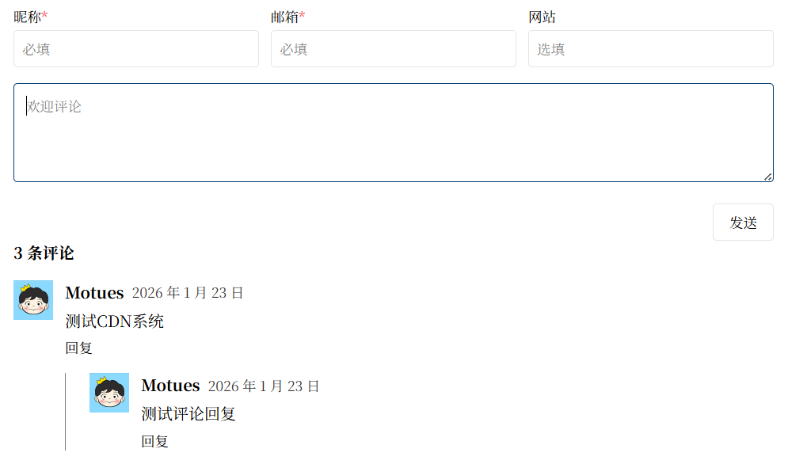

# Momo Comment Frontend

简单、易用的前端评论组件，使用 Svelte 构建，支持多语言与黑暗模式。

## 快速使用

只需要导入一个js文件，就可以在前端使用。

```html
<div id="momo-comment"></div>

<script src="https://cdn.jsdelivr.net/npm/@motues/momo-comment/dist/momo-comment.min.js"></script>
<script>
    momo.init({
        el: '#momo-comment', // 评论容器的 id
        title: 'Test', // 文章标题
        slugId: 'blog/test', // 文章的唯一 slugId
        lang: 'zh-cn', // 语言，目前支持 zh-cn, en
        apiUrl: 'https://api-momo.motues.top' // 后端地址
        });
</script>
```

## 自定义样式

目前可以修改评论组件的颜色，后续会推出自定义样式的功能。颜色通过设置全局变量来修改，并且支持黑暗模式。

```css
:root {
    --momo-text-color: #d51111;            /* 文字颜色 */
    --momo-button-border-color: #e5e5e5;   /* 按钮边框颜色 */
    --momo-button-hover-bg-color: #f5f5f5; /* 按钮背景颜色（hover 状态）*/
    --momo-link-color: #003b6e;            /* 链接颜色 */
}
[data-theme="dark"] { 
    --momo-text-color: #3ad8d8;
    --momo-button-border-color: #2e2e2e;
    --momo-button-hover-bg-color: #3c3c3c;
    --momo-link-color: #fff;
}
```

## 本地编译

你也可以下载源码，本地编译出js文件，导入到自己的网站中：

#### 1. 克隆项目，安装依赖

可以直接克隆仓库代码，或者从 Release 下载最新的稳定代码，这里推荐选择后面一种。

* **克隆仓库**
	```bash
	git clone https://github.com/Motues/Momo-Backend.git
	cd Momo-Backend/frontend
	pnpm install
	```
* **从 Release 下载代码**，可以使用命令行，也可以浏览器直接下载然后解压
	```bash
	wget https://github.com/Motues/Momo-Backend/releases/latest/download/frontend.zip
    unzip frontend.zip
    cd frontend
    pnpm install
	```

#### 2. 编译

编译后的文件在 dist 目录下，文件名为 `momo-comment.min.js`。

```bash
pnpm build
```

## 样式效果

