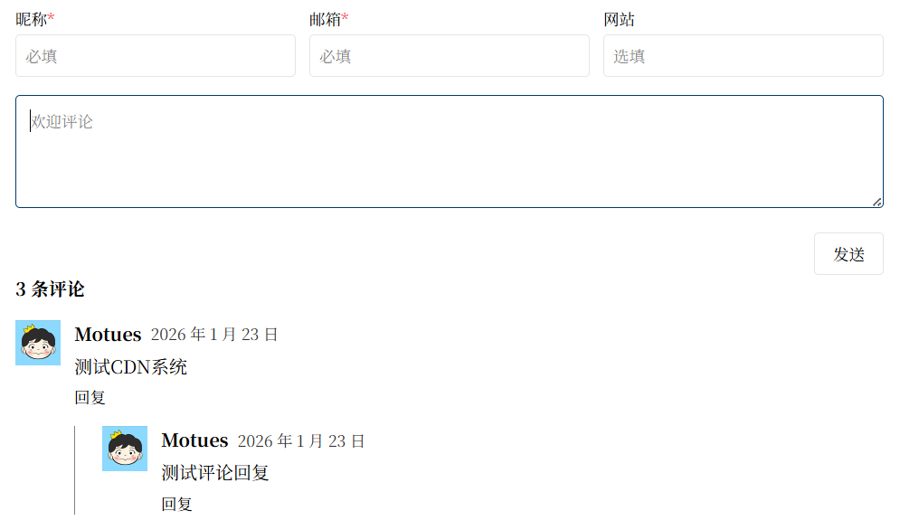

# Momo Comment Frontend

简单、易用的前端评论组件，使用 Svelte 构建，支持多语言与黑暗模式。

## 快速使用

只需要导入一个js文件，就可以在前端使用。

```html
<div id="momo-comment"></div>

<script src="https://cdn.jsdelivr.net/npm/@motues/momo-comment@1.5.x/dist/momo-comment.min.js"></script>
<script>
    momo.init({
        el: '#momo-comment', // 评论容器的 id
        title: 'Test', // 文章标题
        slugId: 'blog/test', // 文章的唯一 slugId
        lang: 'zh-cn', // 语言，目前支持 zh-cn, en
        apiUrl: 'https://api-momo.motues.top' // 后端地址
        });
</script>
```

> 建议使用版本号锁定版本，避免版本更新导致冲突

## ⚠️ 版本与后端的配套要求（1.5.1 起为破坏性变更）

1.5.1 起评论区组件使用**协议 v2** 的人机验证（第一层为 HashWX 工作量证明，第二层为 Instrumentation 环境质询），必须与同时升级的后端配套。注意**包版本与协议版本是两件事**：包版本是 1.5.1，协议版本号是 `v2`。

| 前端版本 | 需要搭配的后端 |
|---|---|
| 1.5.0 及更早 | v1 后端（旧版 SHA-256 无感验证） |
| 1.5.1 及以后 | v2 后端（HashWX + Instrumentation 环境质询） |

- 前端 1.5.1 连到仍是 v1 的后端时，验证框会明确显示「验证服务版本过旧，请联系博主升级」，而不是笼统的「验证失败」（且不会给出无用的重试按钮）。
- 旧版前端 1.x 连到已升级 v2 的后端时，验证会失败（后端返回 `reason: "PROTOCOL_OUTDATED"`），请把页面里引用的 CDN 版本一起升级。
- 第一层工作量证明需要浏览器支持 **WebAssembly**（iOS 15+ 及现代桌面浏览器）。不支持时验证框会提示「浏览器版本过低，不支持验证」，该浏览器将无法提交评论。
- 验证在后台静默完成：优先使用 Web Worker 并行计算，宿主页面 CSP 不允许 Worker 时自动降级到主线程分片计算（页面仍可滚动、输入）。

## 第三方组件

本包的验证功能内联了第三方的 HashWX WebAssembly 模块，它以 **LGPL-3.0** 分发，
与本项目自身的 MIT 许可证不同。许可证全文与构件来源见
[`vendor/hashwx/README.md`](./vendor/hashwx/README.md) 与 [`THIRD_PARTY_NOTICES.md`](./THIRD_PARTY_NOTICES.md)。

## 自定义样式

目前可以修改评论组件的颜色，后续会推出自定义样式的功能。颜色通过设置全局变量来修改，并且支持黑暗模式。

```css
:root {
    --momo-text-color: #d51111;            /* 文字颜色 */
    --momo-button-border-color: #e5e5e5;   /* 按钮边框颜色 */
    --momo-button-hover-bg-color: #f5f5f5; /* 按钮背景颜色（hover 状态）*/
    --momo-link-color: #003b6e;            /* 链接颜色 */
}
/* 暗色模式 */
[data-theme="dark"] { 
    --momo-text-color: #3ad8d8;
    --momo-button-border-color: #2e2e2e;
    --momo-button-hover-bg-color: #3c3c3c;
    --momo-link-color: #fff;
}
```

## 本地编译

你也可以下载源码，本地编译出js文件，导入到自己的网站中：

#### 1. 克隆项目，安装依赖

克隆仓库代码

```bash
git clone https://github.com/Motues/Momo-Backend.git
cd Momo-Backend/frontend
pnpm install
```

#### 2. 编译

编译后的文件在 dist 目录下，文件名为 `momo-comment.min.js`。

```bash
pnpm build
```

## 样式效果

