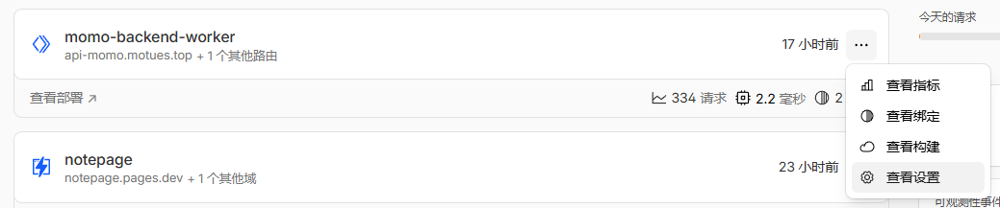

# Momo Backend Worker

Cloudflare Worker 版本基于 Cloudflare Workers + D1 + KV 实现，无需服务器即可部署运行。

## 部署条件

* 拥有一个 Node.js 运行环境，版本 >= 22
* 拥有一个 Cloudflare 账号（这个使用邮箱即可注册，[官网地址](https://www.cloudflare.com/)）
* 拥有一个域名并托管在 Cloudflare 上（这个不是必须项，但可以提高国内访问速度，也更方便）

## 快速部署

**1. 克隆项目，安装依赖**

可以直接克隆仓库代码，或者从 Release 下载最新的稳定代码，这里推荐选择后面一种。

* 克隆仓库
	```bash
	git clone https://github.com/Motues/Momo-Backend.git
	cd Momo-Backend/worker
	pnpm install
	```
* 从 Release 下载代码，可以使用命令行，也可以浏览器直接下载然后解压
	```bash
	curl -L https://github.com/Motues/Momo-Backend/releases/latest/download/worker.zip -o worker.zip
	unzip worker.zip
	cd worker
	pnpm install
	```

**2. 配置Cloudflare Workers**

对于 D1 和 KV 配置，有两种方法，第一种是直接使用命令行配置，第二种是使用网页面板创建后填写配置文件，这里推荐使用第一种方法。如果想要使用之前 Cloudflare 上面已经创建的数据库，可以选择自行配置 `wrangler.jsonc` 文件。

下面介绍第一种方法。

* **登录到 Cloudflare**
	```bash
	npx wrangler login
	```
* **创建数据库和数据库表**，如果遇到提示，请按回车继续
	```bash
	npx wrangler d1 create MOMO_DB
	npx wrangler d1 execute MOMO_DB --remote --file=./schemas/comment.sql
	```
	运行完成后可以确认一下 `wrangler.jsonc` 中是否有如下配置
	```jsonc
	"d1_databases": [
		{
			"binding": "MOMO_DB",
			"database_name": "MOMO_DB",
			"database_id": "xxxxxx" // D1 数据库 ID
		}
	]
	```
	如果`binding`字段不是`MOMO_DB`，请修改为`MOMO_DB`
* **创建 KV 存储**，如果遇到提示，按回车继续
	```bash
	npx wrangler kv namespace create MOMO_AUTH_KV
	```
	运行完成后可以确认一下 `wrangler.jsonc` 中是否有如下配置
	```jsonc
	"kv_namespaces": [
	    {
	        "binding": "MOMO_AUTH_KV",
	        "id": "xxxxxxx" // KV 存储 ID
	    }
	]
	```
* **部署上线**
	```bash
	npx wrangler deploy
	```

没有异常报错后，可以进入Cloudflare Workers 面板查看是否部署成功，若显示存在一个名称为 `momo-backend-worker` 的项目即推送成功。


**3. 配置环境变量**

* 登录 Worker 面板，点击项目右侧的 Settings (设置) 选项卡，选择`查看设置`
	
* 点击变量和机密右侧的添加按钮，给项目添加环境变量，环境变量[参考](#环境变量)
	
* 部署生效：点击底部的 Save and deploy (保存并部署)。

**4. 检测部署情况**

部署成功后回得到一个域名，即为后端的域名（格式一般为`https://momo-backend-worker.xxx.workers.dev`。访问该域名，如果显示后端管理页面并可以正常登录则部署成功，将此域名填写到博客的配置文件中即可使用评论功能。

当然也可以使用自定义域名，注意不要使用三级域名，即`*.*.example.com`。

## 环境变量

所需环境变量如下所示，请参考 [`.dev.vars.example`](.dev.vars.example) 文件

| 变量名 | 描述 |
| --- | --- |
| `ALLOW_ORIGIN` | 允许跨域请求的域名，用逗号分隔 |
| `RESEND_API_KEY` | Resend API Key，用于启用邮件通知服务，如**果不需要邮件通知服务，可以不填** |
| `RESEND_FROM_EMAIL` | Resend 发送邮件的邮箱，用于邮件通知服务，**如果不需要邮件通知服务，可以不填** |
| `EMAIL_ADDRESS` | 管理员接收通知邮件的邮箱，用于邮件通知服务，**如果不需要邮件通知服务，可以不填** |
| `ADMIN_NAME` | 管理员登录名称，默认为 admin |
| `ADMIN_PASSWORD` | 管理员登录密码，默认密码为 password |

**注:** [Resend 官网](https://resend.com/)


## 本地测试

如果需要本地测试，环境变量可以使用 `.dev.vars` 文件来设置

```bash
cp .dev.vars.example .dev.vars
# 编辑 .dev.vars 文件
```