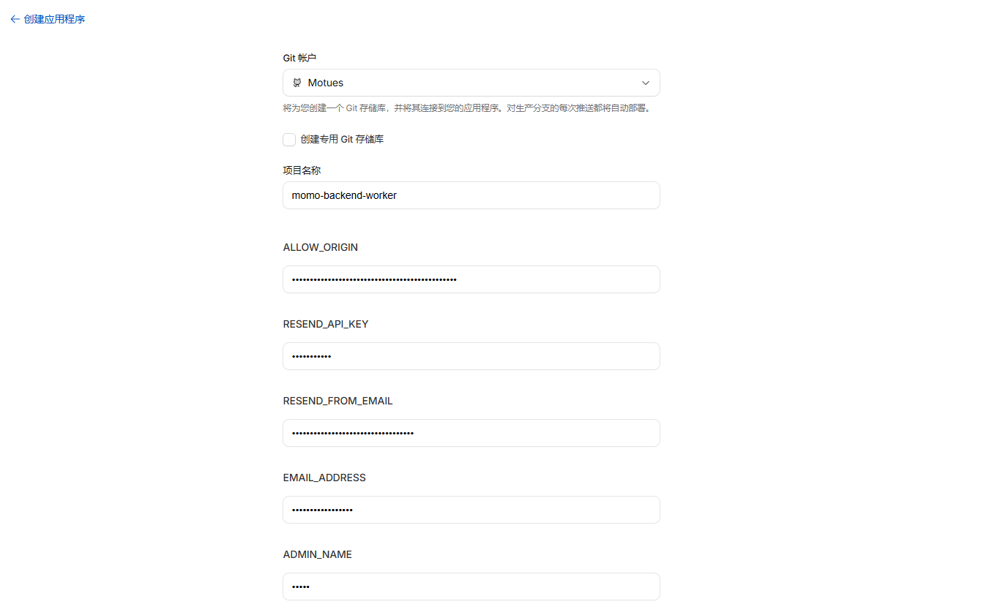
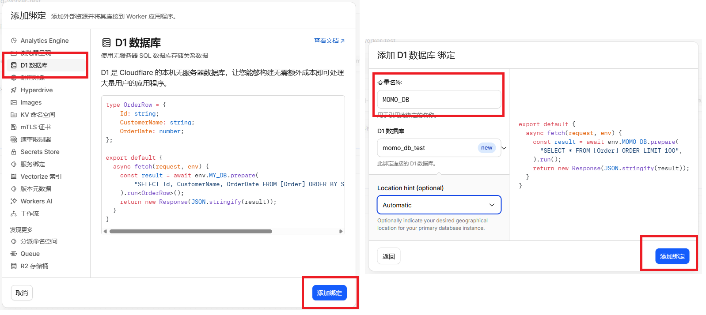
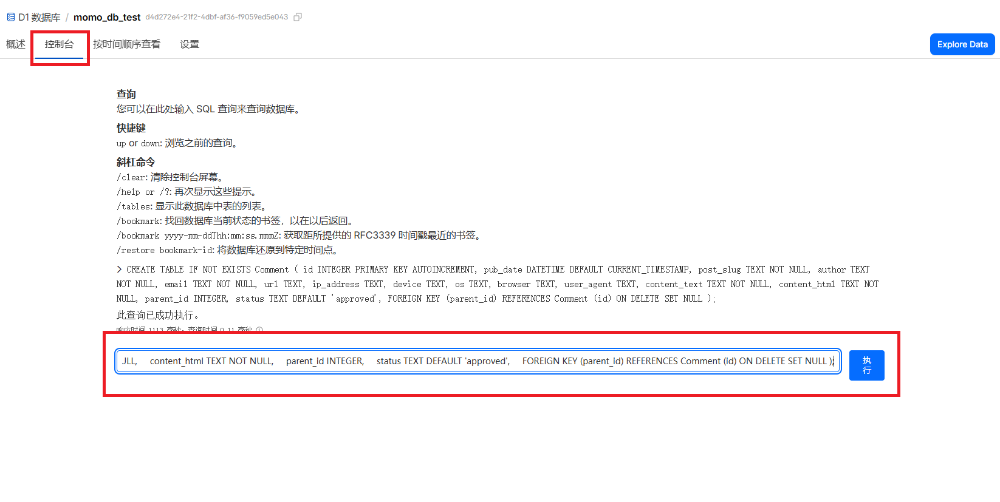
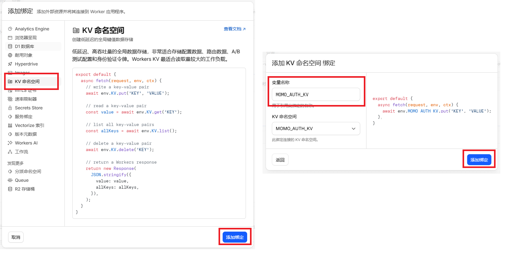
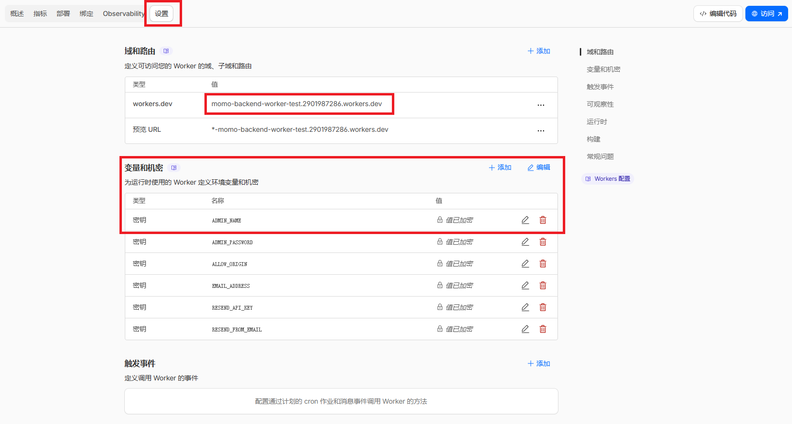
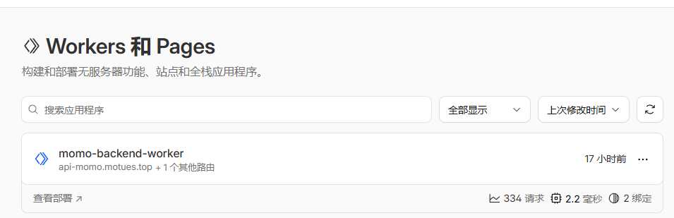

# Momo Backend Worker

Cloudflare Worker 版本基于 Cloudflare Workers + D1 + KV 实现，无需服务器即可部署运行。

## 部署条件

* 拥有一个 Cloudflare 账号（使用邮箱即可注册，[官网地址](https://www.cloudflare.com/)）
* 拥有一个 Node.js 运行环境，版本 >= 22（本地部署需要）
* 拥有一个域名并托管在 Cloudflare 上（这个不是必须项，但可以提高国内访问速度，也更方便）

## 部署

目前提供两种部署方式：1. [一键部署](#一键部署) 2. [本地部署](#本地部署)。

一键部署不需要 Node.js 环境，所有操作在操作面板上完成，操作过程可能会稍微复杂一点；本地部署需要用于 Node.js 环境，但是大部分配置都可以使用命令行完成，操作相对更加简单，也方便后期二次开发。可以根据自己的需求进行选择。

### 一键部署

#### 1. 点击下方按钮进行部署

[](https://deploy.workers.cloudflare.com/?url=https://github.com/Motues/Momo-Backend/tree/main/worker)

注意：如果没有绑定Github账号的，可能需要进行一下绑定。

#### 2. 填写信息

根据自己的需求填写需要的信息，这里的环境变量可以先不修改，等之后在设置中修改。

填写完成后下滑，点击 `创建和部署` 按钮。



#### 3. 绑定 D1 和 KV

等构建完成后进入如下页面，点击中间的 `添加绑定` 按钮，进行数据库的绑定。


首先绑定数据库，左侧选择 `D1数据库`，然后点击右下角的添加绑定。然后需要设置数据库的相关信息，这里变量名称一定要填写为 `MOMO_DB`，数据库可以选择已有的，或者创建一个新的。完成之后点击右下角的 `添加绑定` 按钮。



创建之后我们点击该数据库，进入管理页面；点击左上方选项卡中的 `控制台` 选项，并分别执行下面三条的 SQL 语句，创建表结构。

```sql
CREATE TABLE IF NOT EXISTS Comment (
    id INTEGER PRIMARY KEY AUTOINCREMENT,
    pub_date DATETIME DEFAULT CURRENT_TIMESTAMP,
    post_slug TEXT NOT NULL,
    author TEXT NOT NULL,
    email TEXT NOT NULL,
    url TEXT,
    ip_address TEXT,
    device TEXT,
    os TEXT,
    browser TEXT,
    user_agent TEXT,
    content_text TEXT NOT NULL,
    content_html TEXT NOT NULL,
    parent_id INTEGER,
    status TEXT DEFAULT 'approved',
    FOREIGN KEY (parent_id) REFERENCES Comment (id) ON DELETE SET NULL
);
CREATE INDEX IF NOT EXISTS idx_post_slug ON Comment(post_slug);
CREATE INDEX IF NOT EXISTS idx_status ON Comment(status);
```


KV 命名空间的绑定与数据类似。左侧选择 `KV命名空间`，然后点击右下角的添加绑定。这里的变量名称一定要填写为 `MOMO_AUTH_KV`，KV 选择已有的，或者创建一个新的。完成之后点击右下角的 `添加绑定` 按钮。



#### 4. 设置环境变量

回到面板首页，点击左上方选项卡中的 `设置` 选项，进入设置页面。我们可以看见变量和机密一栏，已经存在一些环境变量，可以点击编辑进行批量修改。这里可以[参考](#环境变量)下面的表格修改环境变量。对于不使用的环境变量，请删除，以免出现不确定的错误。

注意：尽量不要使用默认的管理员名称和密码。



#### 5. 检测部署情况

最后访问 `域和路由` 中提供的域名，一般格式为`https://<your-progect-name>.xxx.workers.dev`，返回如下的管理页面。我们需要将接口地址改为当前的后端地址，用户名和密码填写为管理员名称和密码。

如果成功进入后台则表示部署成功。


### 本地部署

#### 1. 下载代码，安装依赖

可以直接克隆仓库代码，或者从 Release 下载最新的稳定版本代码，这里推荐选择后面一种。

* **克隆仓库**
	```bash
	git clone https://github.com/Motues/Momo-Backend.git
	cd Momo-Backend/worker
	pnpm install
	```
* **从 Release 下载代码**，可以使用命令行，也可以浏览器直接[下载](https://github.com/Motues/Momo-Backend/releases/latest/download/worker.zip)然后解压
	```bash
	wget https://github.com/Motues/Momo-Backend/releases/latest/download/worker.zip
	unzip worker.zip
	cd worker
	pnpm install
	```

#### 2. 配置Cloudflare Workers

对于 D1 和 KV 配置，有两种方法，第一种是直接使用命令行配置，第二种是使用网页面板创建后填写配置文件，这里推荐使用第一种方法。如果想要使用之前 Cloudflare 上面已经创建的数据库，可以选择自行配置 `wrangler.jsonc` 文件。

下面介绍第一种方法。

* **登录到 Cloudflare**
	```bash
	pnpm wrangler login
	```
* **创建数据库和数据库表**，如果遇到提示，请按回车继续
	```bash
	pnpm wrangler d1 create MOMO_DB
	pnpm wrangler d1 execute MOMO_DB --remote --file=./schemas/comment.sql
	```
	运行完成后可以确认一下 `wrangler.jsonc` 中是否有如下配置
	```jsonc
	"d1_databases": [
	    {
	        "binding": "MOMO_DB",
	        "database_name": "MOMO_DB",
	        "database_id": "xxxxxx" // D1 数据库 ID
	    }
	]
	```
	如果`binding`字段不是`MOMO_DB`，请修改为`MOMO_DB`
* **创建 KV 存储**，如果遇到提示，按回车继续
	```bash
	pnpm wrangler kv namespace create MOMO_AUTH_KV
	```
	运行完成后可以确认一下 `wrangler.jsonc` 中是否有如下配置
	```jsonc
	"kv_namespaces": [
	    {
	        "binding": "MOMO_AUTH_KV",
	        "id": "xxxxxxx" // KV 存储 ID
	    }
	]
	```
* **部署上线**
	```bash
	pnpm run deploy
	```

没有异常报错后，可以进入Cloudflare Workers 面板查看是否部署成功，若显示存在一个名称为 `momo-backend-worker` 的项目即推送成功。



#### 3. 配置环境变量

* 登录 Worker 面板，点击项目右侧的 Settings (设置) 选项卡，选择`查看设置`
	
* 点击变量和机密右侧的添加按钮，给项目添加环境变量，环境变量[参考](#环境变量)
	
* 部署生效：点击底部的 Save and deploy (保存并部署)。

#### 4. 检测部署情况

部署成功后回得到一个域名，即为后端的域名（格式一般为`https://momo-backend-worker.xxx.workers.dev`。访问该域名，如果显示后端管理页面并可以正常登录则部署成功，将此域名填写到博客的配置文件中即可使用评论功能。

当然也可以使用自定义域名，注意不要使用三级域名，即`*.*.example.com`。

## 环境变量

所需环境变量如下表所示，请参考 [`.dev.vars.example`](.dev.vars.example) 文件

| 变量名 | 描述 |
| --- | --- |
| `ALLOW_ORIGIN` | 允许跨域请求的域名，用逗号分隔 |
| `RESEND_API_KEY` | Resend API Key，用于启用邮件通知服务，如**果不需要邮件通知服务，可以不填** |
| `RESEND_FROM_EMAIL` | Resend 发送邮件的邮箱，用于邮件通知服务，**如果不需要邮件通知服务，可以不填** |
| `EMAIL_ADDRESS` | 管理员接收通知邮件的邮箱，用于邮件通知服务，**如果不需要邮件通知服务，可以不填** |
| `ADMIN_NAME` | 管理员登录名称，默认为 admin |
| `ADMIN_PASSWORD` | 管理员登录密码，默认密码为 password |

**注:** [Resend 官网](https://resend.com/)


## 本地测试

如果需要本地测试，环境变量可以使用 `.dev.vars` 文件来设置

```bash
cp .dev.vars.example .dev.vars
# 编辑 .dev.vars 文件
pnpm run dev
```